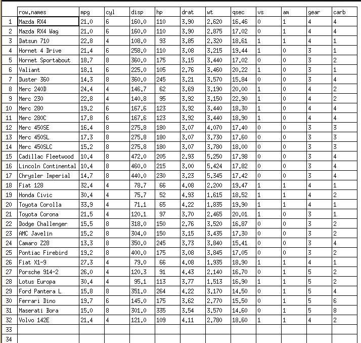
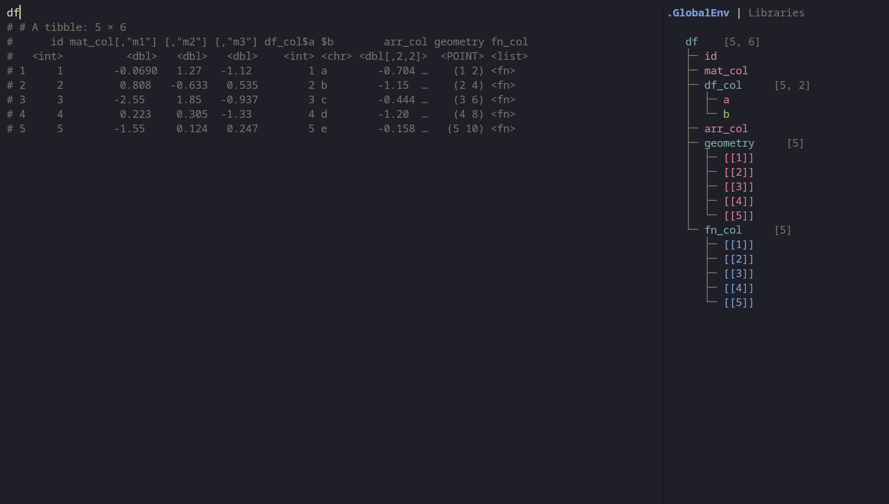
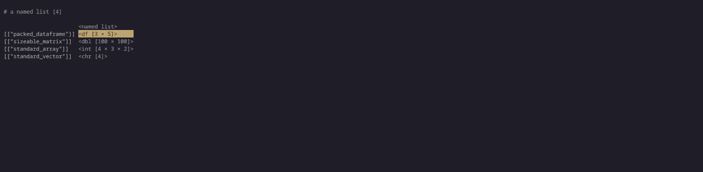
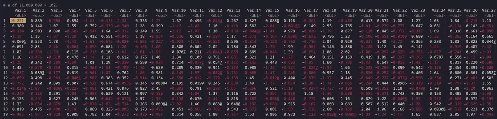

### The Problem

I have always been looking for ways to become a more efficient in my work. Despite
creating tons of keybindings for tasks I do commonly, building several packages to make 
my analyses easier, and reading a whole bunch of R docs pages, the single most impactful
change to my efficiency has been learning vim motions.

I started learning vim motions in VSCode, then Positron, and over the past year, 
I have completely ditched Positron and RStudio for my R development and fully embraced 
neovim (thanks in part to this [great blog post](https://adamhsparks.netlify.app/2026/03/10/further-enhancing-r-nvim-with-arf-and-terminalgraphics/)).
I am completely in love with neovim and am beginnning to finally feel like I have
my neovim config pretty dialed in. But I still have one minor annoyance: the lack of
an interactive data viewer.

By default on my machine, when you call `View()` on a data.frame, you get something like this:

{width="50%" fig-align="center"}

Not exactly a sight for sore eyes.

There are ways to make this a little better. In `R.nvim` there are ways to make this a lot more bearable 
like a keybinding to print an object as a comment or a global environment viewer. However, neither of these
quite satisfy my desire to interactively step through an object in the same way you can within RStudio. 

{width="80%" fig-align="center"}

So I created an R package of my own that does just that. `legs` is a neovim-first TUI data viewer for R which
leverages the power of the [`pillar`](https://pillar.r-lib.org/) R package to allow you to interactively explore 
`data.frame`s, `matrix`s, `array`s, `list`s, and `vector`s.



### How it works

Built in Rust, `legs` is performant. To keep memory overhead minimal, `legs` calculates the exact bounding 
box of rows and columns visible in your current viewport. It then calls `pillar::ctl_new_pillar_list`
only on that visible subset of R data. This allows legs to honor R data formatting conventions while maintaining 
the ability to quickly maneuver through a dataset.

As an example, here it is maneuvering through a dataset almost a gigabyte in size.

<details>
<summary>Code</summary>

```r
num_rows <- 1000000
num_cols <- 100

big_matrix <- matrix(rnorm(num_rows * num_cols), nrow = num_rows, ncol = num_cols)
big_df <- as.data.frame(big_matrix)

colnames(big_df) <- paste0("Var_", 1:num_cols)
big_df$ID <- paste0("ID_", 1:num_rows)
big_df$Group <- as.factor(sample(c("Control", "Treatment_A", "Treatment_B"), num_rows, replace = TRUE))

print(lobstr::obj_size(big_df))
# 875.93 MB
legs::view(big_df)
```
</details>





### Try it out

You can install the development version of legs from GitHub with:

```r
# install.packages("pak")
pak::pak("ryanzomorrodi/legs")
```

`legs` does not work in Positron or RStudio because of limitations within their
implemenation of the R console. It does however work inside of a normal R terminal or an 
[`arf`](https://github.com/eitsupi/arf) session.

If you have any additional feature ideas, please feel free to [create an issue](https://github.com/ryanzomorrodi/legs/issues/new/choose).
